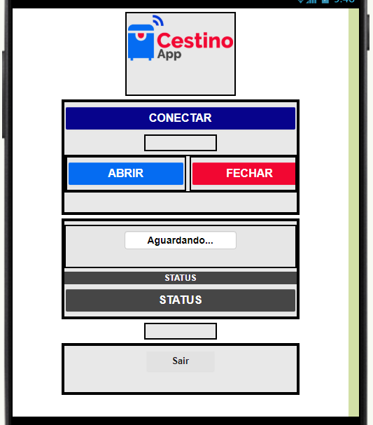

# Lixeira-Inteligente

Projeto desenvolvido pelo aluno Cleison Mendes Paiva 
Disciplina de Projeto Interdisciplinar 2 do curso de Sistemas de Informação lecionado na faculdade UCL

Lixeira inteligente que funciona via bluetooth com app desenvolvido no APP INVENTOR,e que tambem funcione via sensor ultrasonico

# Interface do APP:

