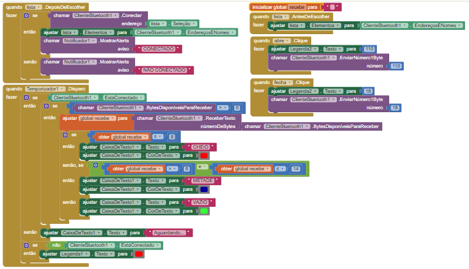

# Lixeira-Inteligente

Projeto desenvolvido pelo aluno Cleison Mendes Paiva 
Disciplina de Projeto Interdisciplinar 2 do curso de Sistemas de Informação lecionado na faculdade UCL

Lista de materiais utilizados:
1 Arduino UNO
1 Protoboard Pequena
1 Modulo bluetooth HC05
2 Sensores Ultrasonicos
1 Servo Motor
1 Lixeira de Pia de Cozinha
Cabos Jumpers

Lixeira inteligente que funciona via bluetooth com app desenvolvido no APP INVENTOR,e que tambem funcione via sensor ultrasonico

# Interface do APP:

# Esquemas de Blocos:

No arquivo  CestinoApp(1).aia esta todo App e em Lixeira_Automatica esta o codigo utilizado no Arduino

